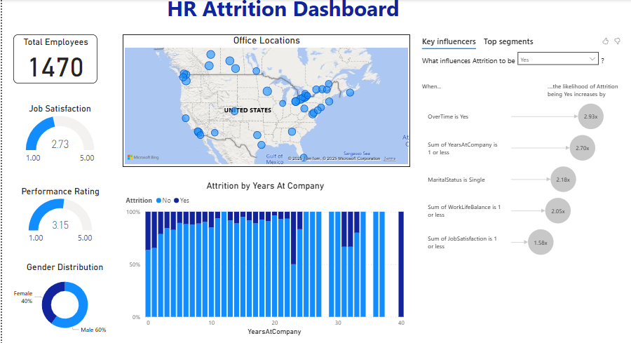
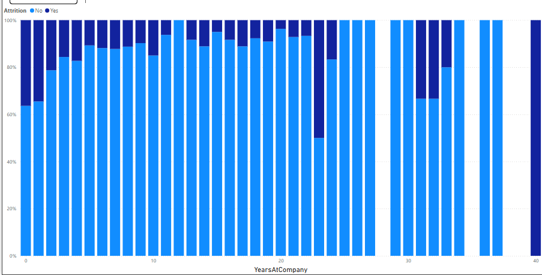
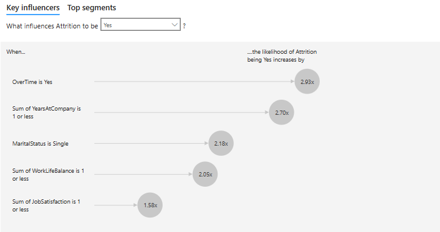
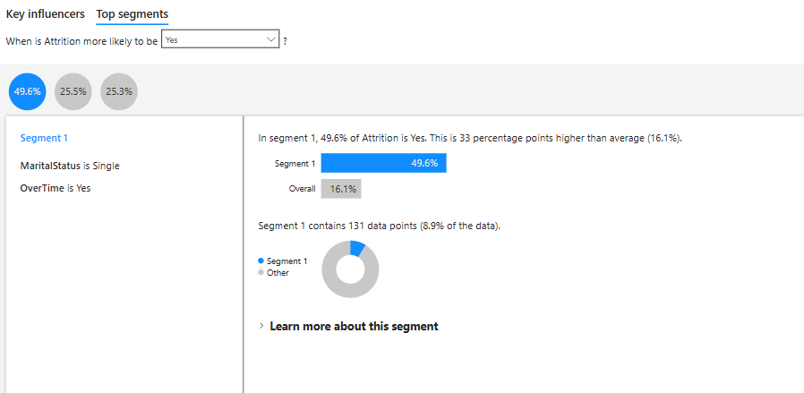

# Employee Attrition Analysis in Power BI

## Introduction
Employee attrition is a critical challenge that impacts productivity, company culture, and financial stability. Addressing this issue begins with understanding its root causes. This dashboard was built to uncover actionable insights into **why employees leave** and help stakeholders make **data-driven decisions** to improve retention.

This project showcases my ability to use data storytelling to effectively communicate insights through visualizations and interactive dashboards, while also demonstrating my technical problem-solving skills.

# HR Attrition Dashboard

Below is the complete HR Attrition Dashboard, designed to provide a clear overview of the organization's attrition patterns and key influencing factors:

The dashboard is divided into individual visuals that answer specific questions, each leading to actionable recommendations.

## Visuals Breakdown

### Attrition Overview
- **Insight:** Out of **1,470 employees**, **237** have left the company, representing **16.1% attrition**.
- **Actionable Recommendation:** Focus efforts on retaining employees by addressing underlying causes.

### Job Satisfaction and Performance
- **Insight:** The average **job satisfaction** is **2.73** (on a 1-5 scale), while the average **performance rating** is **3.15**. Attrition occurs mainly among employees with a **lower average satisfaction of 2.47**, with no significant difference in performance rating.
- **Actionable Recommendation:** Implement initiatives to **boost job satisfaction**, such as recognition programs and engagement surveys.

### Attrition by Tenure

- **Insight:** Employees in their first **3 years at the company** are most likely to leave, with attrition decreasing significantly as tenure increases.
- **Actionable Recommendation:** Strengthen **onboarding programs** and create **early-stage career development plans** to help new employees feel secure and valued.

### Key Influencers of Attrition

The analysis revealed several significant factors that influence employee attrition:

- **Overtime:** Employees who work overtime are **nearly 3 times more likely to leave** compared to those who do not work overtime. This indicates that excessive workloads are a major stressor leading to higher attrition.  
- **Short Tenure:** Employees who have been with the company for **1 year or less** are **2.7 times more likely to leave** than longer-tenured employees. This highlights a critical need for stronger onboarding and engagement within the first year.  
- **Single Marital Status:** Single employees are **2.18 times more likely to leave** compared to married employees. This suggests that single employees may lack the work-life balance and social support that married employees might benefit from.  
- **Work-Life Balance and Job Satisfaction:** Poor work-life balance and job satisfaction of 1 or below are significant contributors to attrition, especially among the employees who have already left.  

**What This Means:** These insights suggest that work-related stress, insufficient early-stage support, and dissatisfaction with work-life balance are key drivers of attrition.  

**Recommendations:**
- Introduce initiatives to improve work-life balance, such as flexible work schedules and wellness programs.  
- Closely monitor overtime hours and adjust workloads to reduce stress.  
- Develop engagement strategies targeting single employees, such as building mentorship opportunities and social support networks.  
- Improve job satisfaction by recognizing employee contributions, fostering a positive work culture, and ensuring transparent communication.

### Top Segment at Risk

From the analysis, the segment most at risk of leaving includes **single employees** who work overtime, with a **49.6% likelihood of leaving**. This group represents a critical focus area for retention efforts.  

**What This Means:** Single employees who are burdened with overtime experience higher levels of stress and dissatisfaction, making them significantly more likely to leave the organization.  

**Recommendations:**
- Provide targeted support for this segment, such as reducing overtime hours and offering workplace wellness initiatives.  
- Implement balanced workload distribution and create programs that enhance job satisfaction for single employees.  
- Consider introducing social engagement initiatives to make the workplace more inclusive and supportive for single employees.  

---

## Overcoming Challenges

During the project, I encountered inconsistencies in office location data. While the dataset indicated offices were based in **US** and **Canada**, two entries—**London (UK)** and **Victoria (Australia)**—were clearly out of place.

### Solution
To resolve this issue:
1. I imported a new dataset containing **latitude and longitude data** for all valid office locations.
2. Using **city names** as the key, I joined the new dataset to the model.
3. Finally, I replaced the original office locations with the corrected city names and precise geographic coordinates from the new table.

This step ensured data accuracy and improved the reliability of insights derived from the dashboard.

---

## Conclusion

The HR Attrition Dashboard provides actionable insights into employee attrition, addressing key factors like **job satisfaction**, **work-life balance**, and **overtime stress**. By solving the office location challenge, I reinforced the integrity of the dataset, further enhancing the quality of the analysis.

---

## Recommendations
1. **Enhance onboarding programs** to reduce early attrition.
2. **Monitor workload distribution** to address overtime stress.
3. **Conduct regular satisfaction surveys** to track engagement and address concerns proactively.
4. **Focus on key at-risk segments** such as single employees working overtime, with targeted retention strategies.

---

## About This Project
This project demonstrates my expertise in **Power BI**, **SQL**, and data visualization techniques. It highlights my ability to analyze HR data, identify trends, and address inconsistencies in datasets—such as resolving office location inaccuracies using latitude and longitude data. 

By creating an interactive dashboard, I showcased my storytelling skills, turning complex datasets into actionable insights for stakeholders.

## Power BI File  

The complete dashboard file is available for download:  
[HR Attrition Dashboard - Power BI File](HR%20dashboard.pbix)
